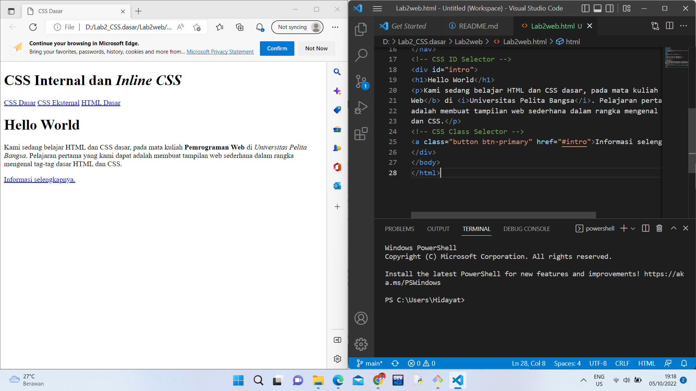
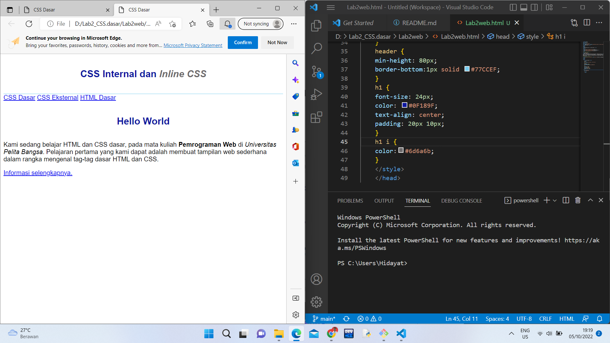
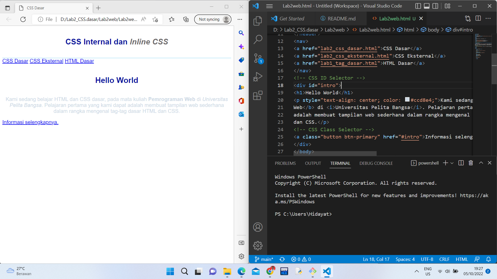
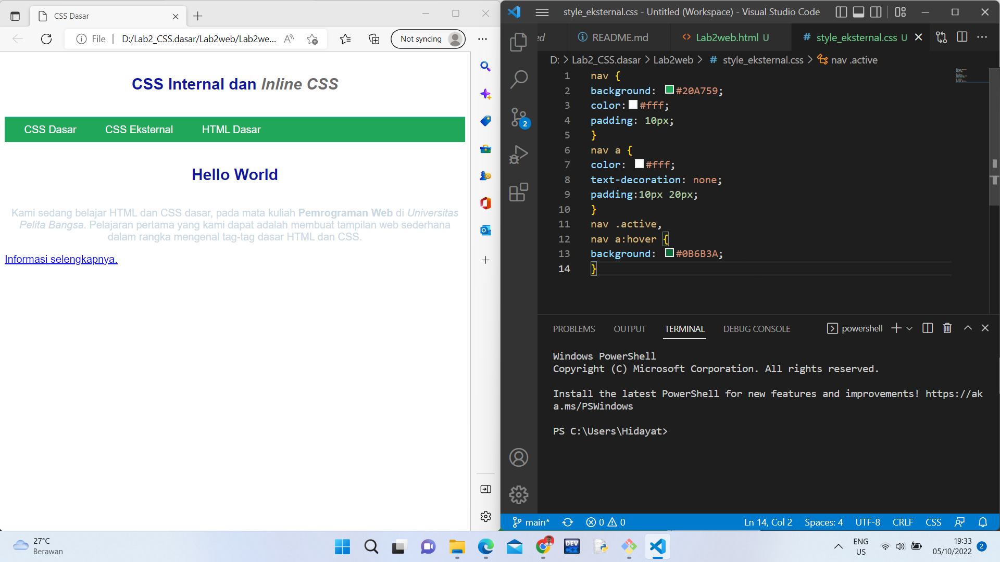
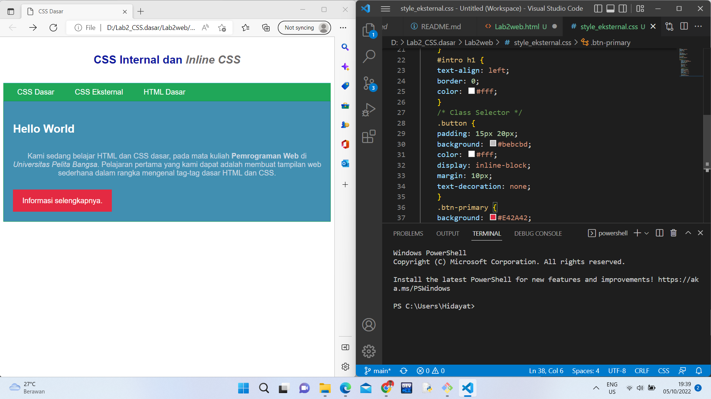

# Lab2_css
## Hidayat Tulloh
## 312110110
## TI.21.B.1

1. Proses Pertama Membuat dokumen HTML baru di VSCode 

2. Membuat Mendeklarasikan CSS Internal

3. Menambahkan Inline CSS pada tag 

4. Membuat CSS Eksternal file baru dengan nama style_eksternal.css untuk deklarasi CSS

5. Menambahkan CSS Selector Dan menambahkan CSS Selector menggunakan ID dan Class Selector. Pada file
style_eksternal.css

