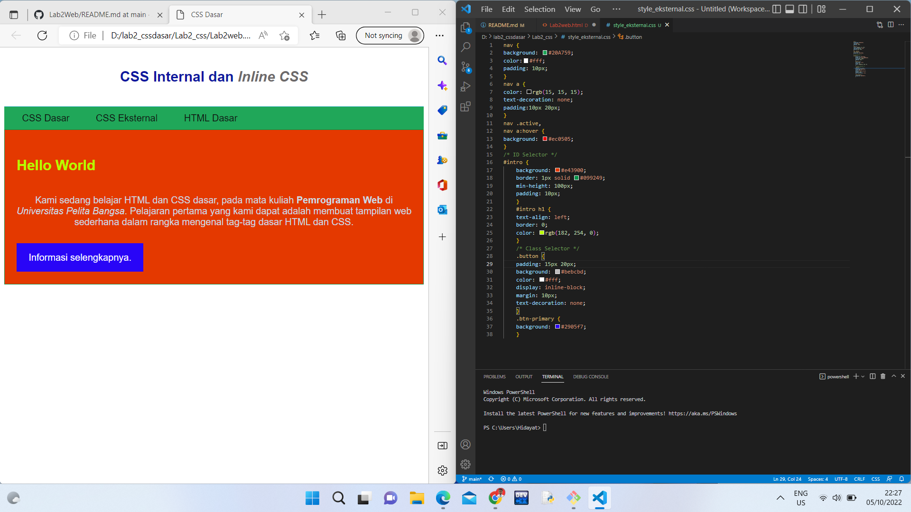

# Lab2_css
## Hidayat Tulloh
## 312110110
## TI.21.B.1

1. Proses Pertama Membuat dokumen HTML baru di VSCode 

2. Membuat Mendeklarasikan CSS Internal

3. Menambahkan Inline CSS pada tag 

4. Membuat CSS Eksternal file baru dengan nama style_eksternal.css untuk deklarasi CSS

5. Menambahkan CSS Selector Dan menambahkan CSS Selector menggunakan ID dan Class Selector. Pada file
style_eksternal.css

JAWAB PERTANYAAN 
SOAL
1. Lakukan eksperimen dengan mengubah dan menambah properti dan nilai pada kode CSS
dengan mengacu pada CSS Cheat Sheet yang diberikan pada file terpisah dari modul ini.

2. Apa perbedaan pendeklarasian CSS elemen h1 {...} dengan #intro h1 {...}? berikan penjelasannya!

3. Apabila ada deklarasi CSS secara internal, lalu ditambahkan CSS eksternal dan inline CSS pada elemen yang sama. Deklarasi manakah yang akan ditampilkan pada browser? Berikan penjelasan dan contohnya!

4. Pada sebuah elemen HTML terdapat ID dan Class, apabila masing-masing selector tersebut terdapat deklarasi CSS, maka deklarasi manakah yang akan ditampilkan pada browser? Berikan penjelasan dan contohnya! (
)

Penyelesaian:

1. 

2. Perbedaan pendeklarasian CSS elemen h1 {...} dengan #intro h1{...}
   h1 {...} adalah pendeklarasian elemen yang hanya merubah elemen pada "h1" yang sudah di tandai sedangkan.
   #intro h1 {...} adalah pendeklarasian yang mengacu kepada pemberian atribut pada "h1" dengan menambahakan ID"intro". 
   
3. Deklarasi yang akan ditampilkan adalah deklarasi Inline yang akan di tampilkan pada Web Browser

4. Apabila masing-masing selector tersebut terdapat deklarasi CSS, maka deklarasi yang akan di tampilkan pada Web Browser adalah Class ID. Karena Class ID secara individu mewakili semua atribut yang ada.
